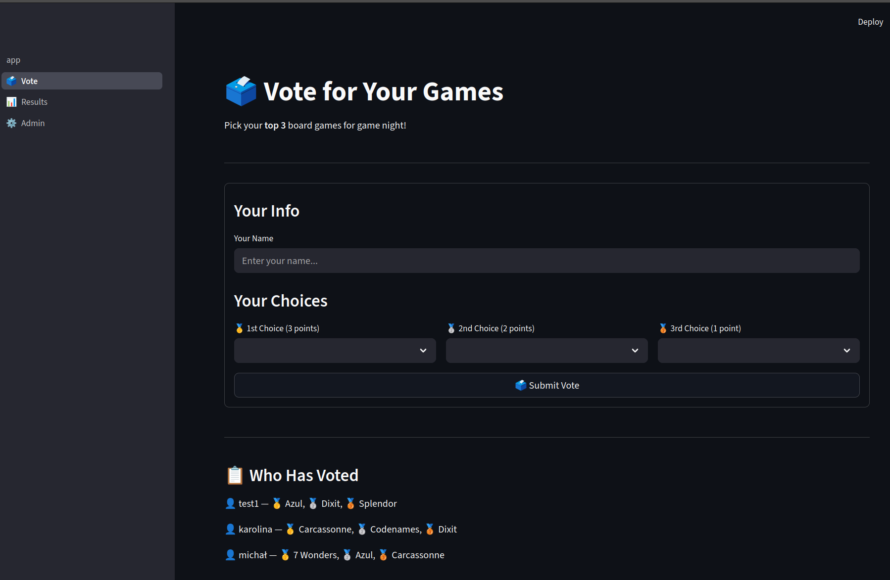
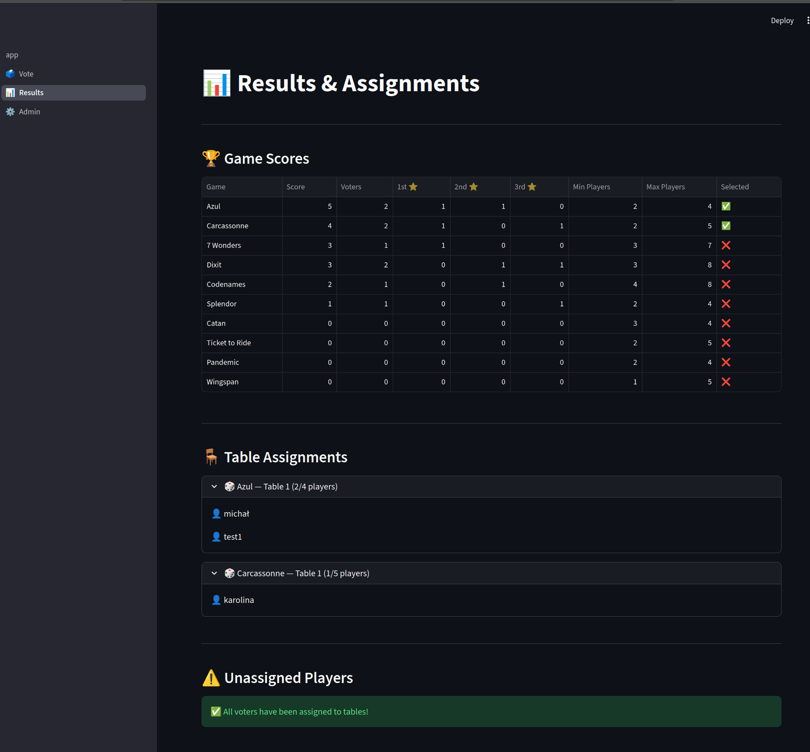
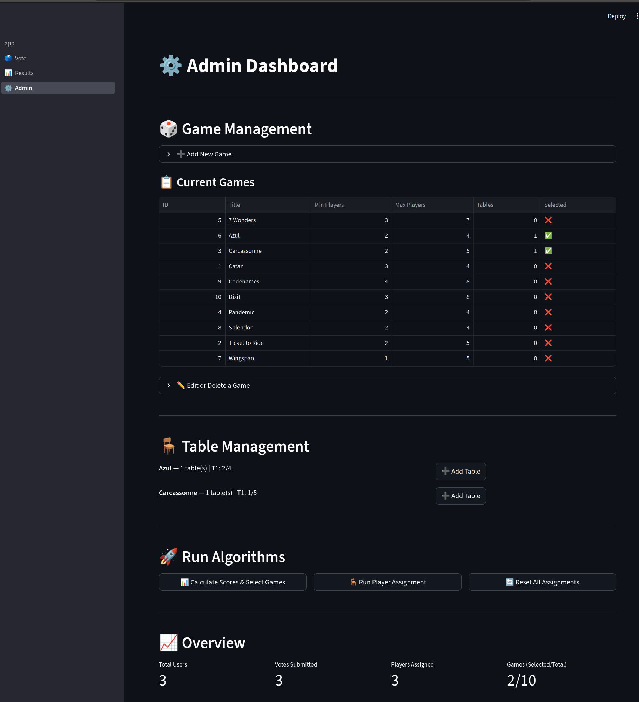

# 🎲 Board Game Night Planner

A web application for organizing board game nights with a group of 8–12 players. Users submit their top three game preferences, the system identifies the most popular titles, and automatically assigns players to tables — with a manual fallback for anyone who can't be placed.

---

## 📋 Table of Contents

- [Screenshots](#-screenshots)
- [Tech Stack](#-tech-stack)
- [Features](#-features)
- [How It Works](#-how-it-works)
  - [Phase 1: Scoring & Game Selection](#phase-1-scoring--game-selection)
  - [Phase 2: Player Assignment](#phase-2-player-assignment)
  - [Phase 3: Fallback for Unassigned Players](#phase-3-fallback-for-unassigned-players)
- [Admin Features](#-admin-features)
- [Database Schema (PostgreSQL)](#-database-schema-postgresql)
- [Google Sheets Integration (Planned)](#-google-sheets-integration-planned)

---

## 📸 Screenshots

### 🗳️ Vote Page


### 📊 Results Page


### ⚙️ Admin Dashboard


---

## 🛠 Tech Stack

| Component   | Technology                          |
| ----------- | ----------------------------------- |
| Language    | Python                              |
| Framework   | Streamlit (or Flask as alternative) |
| Database    | PostgreSQL                          |

---

## ✨ Features

- **Weighted voting** — users pick their top 3 games, ranked by preference
- **Automatic table assignment** — first-come, first-served based on submission time
- **Multiple tables per game** — popular games can run on 2+ tables simultaneously
- **Configurable player limits** — set min/max players per game
- **Fallback mechanism** — unassigned players manually pick from tables with open seats
- **Google Sheets import** — sync your game catalog from a Google Sheet *(planned)*

---

## ⚙ How It Works

### Phase 1: Scoring & Game Selection

Each user submits their top 3 game choices. Votes are weighted:

| Rank       | Points |
| ---------- | ------ |
| 1st choice | 3      |
| 2nd choice | 2      |
| 3rd choice | 1      |

The total score for a game is calculated as:

```
Score = 3 × (# of 1st-choice votes) + 2 × (# of 2nd-choice votes) + 1 × (# of 3rd-choice votes)
```

Games that meet a minimum point threshold **and** have enough interested players to satisfy their `min_players` requirement are selected. Tables are then initialized for those games.

### Phase 2: Player Assignment

Players are assigned to tables using a **first-come, first-served** approach based on the exact timestamp of their form submission:

1. Users are sorted chronologically by submission time
2. The system tries to seat each user at the table of their **1st choice**
3. If that table is full (or the game wasn't selected), it tries the **2nd choice**, then the **3rd**
4. If multiple tables exist for the same game, the system fills them in order

> 💡 **Why first-come, first-served?** It's simple, transparent, and rewards users who submit early — no complex tie-breaking needed.

### Phase 3: Fallback for Unassigned Players

If a user can't be placed at any of their three choices, they are flagged as **unassigned**. When they open the app, they see a special view showing only the tables that still have open seats, and they manually pick one.

---

## 🔧 Admin Features

| Feature                        | Description                                                                 |
| ------------------------------ | --------------------------------------------------------------------------- |
| **Import from XLSX**           | Upload an xlsx file with BGG ID, name, and player count to populate games   |
| **Adjust tables per game**     | Increase or decrease the number of tables running the same game             |
| **Set max players**            | Configure the maximum number of players allowed at each game/table          |
| **View assignments**           | See which players are assigned where, and who is still unassigned           |
| **Trigger assignment**         | Run the automatic assignment algorithm after voting closes                  |

---

## 🗄 Database Schema (PostgreSQL)

### `users`

| Column              | Type                       | Description                                |
| ------------------- | -------------------------- | ------------------------------------------ |
| `id`                | `SERIAL PRIMARY KEY`       | Unique user ID                             |
| `name`              | `VARCHAR(255) NOT NULL`    | User's display name                        |
| `submitted_at`      | `TIMESTAMP`                | When the user submitted preferences        |
| `assigned_table_id` | `INTEGER REFERENCES table_instances(id)` | Which table the user is assigned to |

### `games`

| Column         | Type                    | Description                              |
| -------------- | ----------------------- | ---------------------------------------- |
| `id`           | `SERIAL PRIMARY KEY`    | Unique game ID                           |
| `title`        | `VARCHAR(255) NOT NULL` | Name of the board game                   |
| `min_players`  | `INTEGER NOT NULL`      | Minimum players required                 |
| `max_players`  | `INTEGER NOT NULL`      | Maximum players allowed                  |
| `is_selected`  | `BOOLEAN DEFAULT FALSE` | Whether the game qualified for play      |

### `table_instances`

| Column         | Type                                  | Description                          |
| -------------- | ------------------------------------- | ------------------------------------ |
| `id`           | `SERIAL PRIMARY KEY`                  | Unique table instance ID             |
| `game_id`      | `INTEGER REFERENCES games(id)`        | Which game is played at this table   |
| `table_number` | `INTEGER NOT NULL`                    | Table number (1, 2, 3… per game)     |

> A single game can have multiple `table_instances` — e.g., if Catan is very popular, the admin can create 2 or 3 Catan tables.

### `preferences`

| Column    | Type                                | Description                        |
| --------- | ----------------------------------- | ---------------------------------- |
| `id`      | `SERIAL PRIMARY KEY`                | Unique preference ID               |
| `user_id` | `INTEGER REFERENCES users(id)`      | Who submitted this preference      |
| `game_id` | `INTEGER REFERENCES games(id)`      | Which game was chosen               |
| `rank`    | `INTEGER CHECK (rank IN (1, 2, 3))` | Preference rank (1st, 2nd, or 3rd) |

### Entity Relationships

```
users ──────────── preferences ──────────── games
  │                                           │
  │  assigned to                  has many    │
  ▼                                           ▼
table_instances ◄──────────────────────────────┘
```

---

## 📊 Google Sheets Integration (Planned)

> **Status:** 🔜 Planned feature

Import your game catalog directly from a Google Sheet instead of manually adding games to the database.

**How it will work:**

1. Maintain a Google Sheet with columns: `Title`, `Min Players`, `Max Players`
2. The app connects via `gspread` + Google Service Account credentials
3. On sync (manual trigger or at startup), games are upserted into the `games` table
4. New games appear in voting options; removed games are handled gracefully

**Required setup (when implemented):**
- Google Cloud project with Sheets API enabled
- Service Account with read access to the spreadsheet
- Credentials JSON file configured in the app

---

> 📌 See [DEVELOPMENT_PLAN.md](DEVELOPMENT_PLAN.md) for the full development roadmap.

---

## 🚀 Getting Started

### Option 1: Docker (recommended)

```bash
git clone <repo-url>
cd cal

docker compose up --build
```

Then open http://localhost:8501. The app runs migrations on startup.

### Option 2: Local Python

```bash
git clone <repo-url>
cd cal

# Start PostgreSQL (Docker)
docker compose up -d db

# Install dependencies
pip install -r requirements.txt

# Copy .env.example to .env and adjust if needed
cp .env.example .env

# Run migrations
alembic upgrade head

# Run the app
streamlit run vote.py
```

### Build & Push (for Kubernetes / registry)

```bash
# Build the image
docker build -t your-registry/cal:latest .

# Push to your registry (login first if needed: docker login)
docker push your-registry/cal:latest
```

Replace `your-registry` with your registry (e.g. `ghcr.io/your-org`, `gcr.io/your-project`, `docker.io/your-user`).

---

## 📄 License

This project is licensed under the [MIT License](LICENSE).
